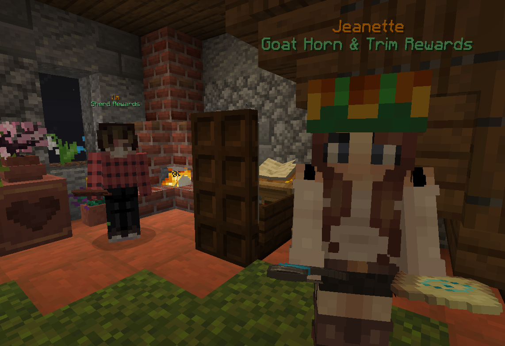
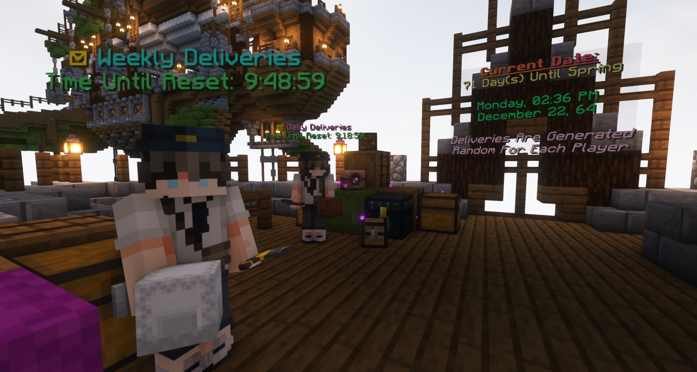
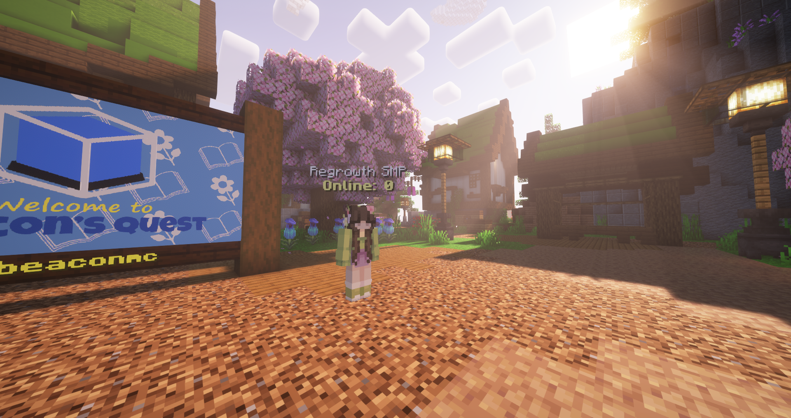
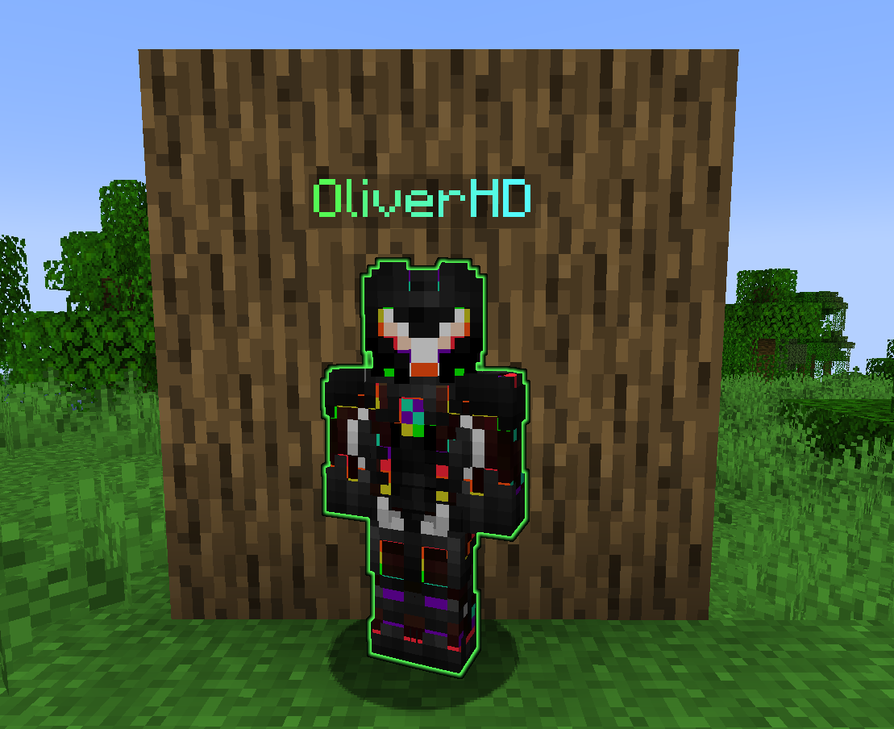
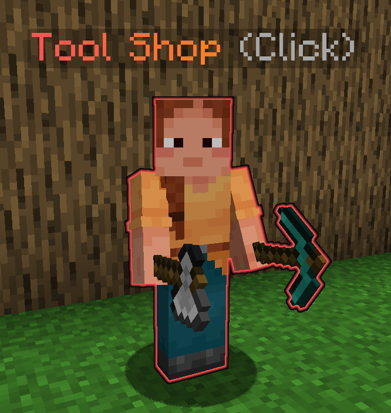

#                            

Simple, lightweight and fast NPC plugin using [packets](https://wiki.vg/Protocol)

**Only for minecraft server version 1.19.4 - 1.20.6** 
_Using [paper](https://papermc.io/downloads) is highly recommended_

## Get the plugin

### Stable versions

- https://hangar.papermc.io/Oliver/FancyNpcs
- https://modrinth.com/plugin/fancynpcs/
- https://github.com/FancyMcPlugins/FancyNpcs/releases

### Development builds

- https://fancyplugins.de/FancyNpcs/download/
- Build from source

## Documentation

You can find the official FancyNpcs documentation here: https://fancyplugins.de/docs/fancynpcs.html

- Getting started: https://fancyplugins.de/docs/fn-getting-started.html
- Commands: https://fancyplugins.de/docs/fn-commands.html
- API: https://fancyplugins.de/docs/fn-api.html

If you have any questions about the plugin/api, feel free to ask in the [discord](https://discord.gg/ZUgYCEJUEx).

## Features

With FancyNpcs you can create NPCs that look like real players. You can edit a bunch of properties like the display name
or skin.

All properties:

- display name
- skin (username or url)
- entity type (cow, pig, blaze etc.)
- equipment (e.g. holding something in the hand)
- glowing (in all colors)
- and many more properties that are entity specific

You can also define some actions that will be executed when a player interacts with the npc:

- message: sends a simple message to the player
- player command: forces the player to execute a command
- server command: executes a command in the console

Explore more features on the official website: https://fancyplugins.de/

### Build from source

1. Clone this repo and run `gradlew shadowJar`
2. The jar file will be in `build/libs/FancyNpcs-<version>.jar`

## Examples

The following images are by https://explorerseden.eu/

The following image is by Beacon's Quest

The following images are by oliver (main dev of this plugin)

